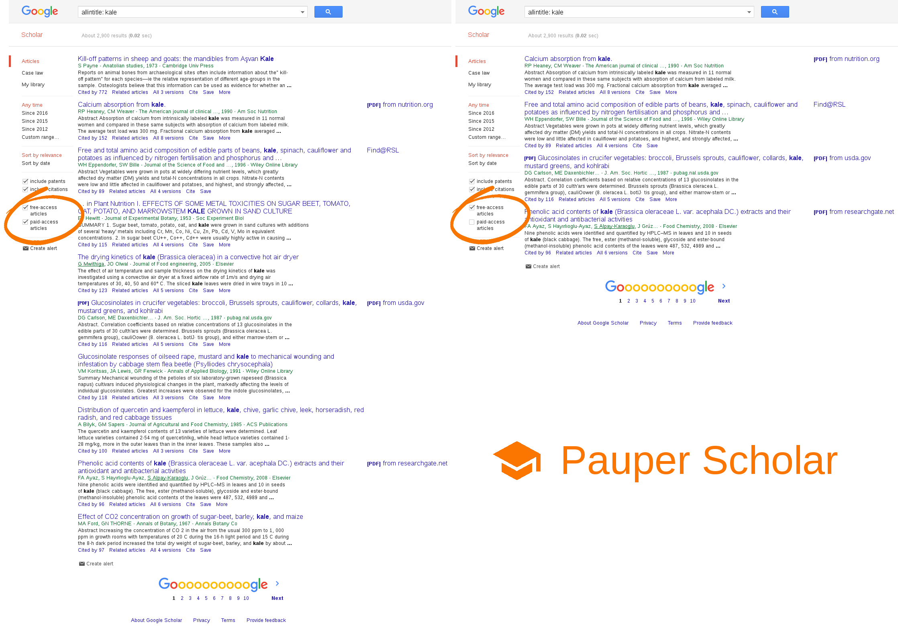

# Pauper Scholar — Get it in [Chrome Web Store]

Pauper Scholar is a Chrome extension for the Google Scholar website which adds an ability to differentiate between free-access and paid-access articles, in particular, it can hide all paid-access articles in search results.

Please note that the extension detects the type of an article based on whether there's a url to an article text or to a library specified in your settings next to its search result. If there's no such a url, the extension claims it's a paid-access one. However, it could still be a free-access one which was indexed wrong (see [Inclusion#Indexing]) and thus lacks a direct url to its text on the search result page.

If you have a relatively small total number of search results, Pauper Scholar recommends that you first look through all free-access results, and then try high-probability paid-access results some of which may turn out to be free-access ones.

## License
See the [LICENSE](LICENSE.md) file for license rights and limitations (MIT).

## Attribution
The Pauper Scholar [icon](src/icon128.png) is a derivative work of the `school` icon from the [Material icons] collection.

   [Chrome Web Store]: <https://chrome.google.com/webstore/detail/pauper-scholar/lefjcofpdmkpcljipkgecoahabpkdjjg>
   [Inclusion#Indexing]: <https://scholar.google.com/intl/en/scholar/inclusion.html#indexing>
   [Material icons]: <https://design.google.com/icons/>
